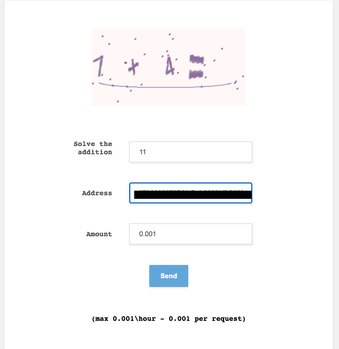
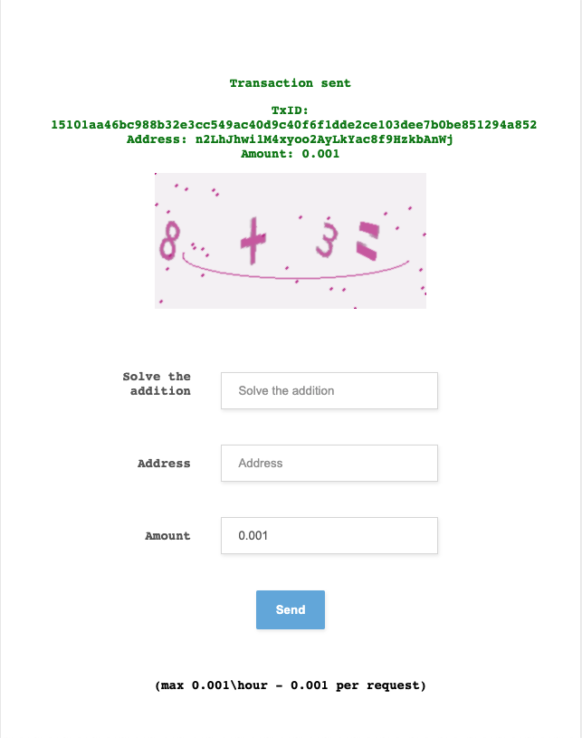

# blockchain-python homework
## Converting Mnemonics to Keys

Create a Mnemonic that you can call the keys to test out crypto currency transactions

## Instructions

* Navigate to the `Releases` Github page for the [BIP39 tool](https://github.com/iancoleman/bip39/releases)
 and download the latest version of `bip39-standalone.html` from the assets dropdown.

* Open the downloaded `bip39-standalone.html` in your favorite browser.

* Either paste your own 12 word mnemonic phrase into the `BIP39 Mnemonic` textbox. Or press the `generate` button to have the system create a mnemonic phrase. [generate mnemonic](BIP39_Mnemonic_Code.pdf)

* Observe the `BIP39 Seed` area. This should contain a random string of numbers and letters. If so, success!

## HD-Wallet-Derive Install Guide

This guide serves as a step by step process for setting up the [`hd-wallet-derive` library](https://github.com/dan-da/hd-wallet-derive) used to derive `BIP32` addresses and private keys for Bitcoin and other alternative coins or "altcoins."

If you need additional help in the installation process, you can follow the step by step video guides in the following links. 

**Note:** Due to updates, some of the videos and images in this guide may reflect older versions of PHP.  Currently the best and most recent version for use with HD-Wallet-Derive is 7.4.

<details><summary>Microsoft Windows Users</summary>

* [Installing PHP for Windows](https://youtu.be/IvcZZaIEL_4)

* [HD Derive Wallet Install for Windows](https://youtu.be/A_tqm4j4vsY)

</details>

<details><summary>macOS Users</summary>

* [Installing PHP Using the Homebrew Package Manger for Mac](https://youtu.be/SNRQSwlOKbs)

* [HD Derive Wallet Install for Mac](https://youtu.be/c-Qc3Pss6oM)

</details>

## Step 1 - Environment Setup

The `hd-wallet-derive` library is written in the PHP language; therefore, you will be required to first set up PHP on your machines before installing and then running the `hd-wallet-derive` library.

<details><summary>Environment Setup in Microsoft Windows Operating System</summary>

For those with a **Windows operating system**, execute the following steps:

1. Windows machines do not come with a pre-built PHP and Apache Web Server, and therefore will require both. Luckily, some installers bundle these two together! Visit the [XAMPP website](https://www.apachefriends.org/index.html) and download the installer for Windows; the XAMPP is a popular PHP development environment that is easy to install and configure. Be sure to download version 7, as version 8 can cause issues with the `hd-wallet-derive` library.

    

2. Use the XAMPP package to install PHP and its associated dependencies. Keep the defaults for now unless there is a dependency conflict.

    

3. Then, once the XAMPP package is installed, navigate to the folder where the PHP binaries are located. This should be at `C:\xampp\php`.

    

4. Edit the `php.ini` file (`C:\xampp\php\php.ini`) using Notepad and add the following line at the end of the file: `extension=php_gmp.dll`. This will enable a necessary PHP extension that `hd-wallet-derive` relies on.

   

5. Next, you need to update the System Environment Variables and add the path containing the PHP binaries (`C:\xampp\php`) to the `PATH` environment variable.

6. For this particular step, we will use the Windows Command Prompt as Administrator as follows: 

      * In the Cortana search field, type in CMD; you will see the Command Prompt application in the search results, choose the "Run as administrator" option to continue.

        

      * You will be asked if you want the Command Prompt to make changes in your system, click on the "Yes" button to continue.

        

      * You will be able to run commands as administrator if you see the title `Administrator: Command Prompt` in the window. In the administrator's prompt, it’ll say `Administrator`, while other prompts will not.

        

7. In this new terminal, type the following command to update the `PATH` system variable.

    ```shell
    setx /M PATH "%PATH%;C:\xampp\php"
    ```

8. If everything was successful, you will see a confirmation message.

   !

9. Test that the newest version of PHP is working. Close all the terminal windows (`git-bash` and Windows Command Prompt), open a new `git-bash` terminal windows, and execute the following command.

    ```shell
    php -version
    ```

10. If you see the following output, then congratulations! Your machine is now updated to the newest version of PHP!

    

 ### Troubleshooting

 ---

 If you do not see something similar to the above output when running ` php -version`, or if you see the error `The data being saved is truncated to 1024 characters`, then your environement variables may not be set correctly. Perform the following steps to make sure your environment variables are correctly set:

  1. Click the Windows search and search for `System Properties` or `Edit System`, then launch the application.

  2. Next at the bottom of the dialog click `Environment variables`.

  3. Then under `System Variables` find the `Path` variable and click `edit`.

  4. Now click `New` and enter your XAMP path, e.g.  `C:\xampp\php`.

  5. Finish by clicking `OK` on each window.

  

</details>

</details>
 
<details><summary>Environment Setup in macOS Operating System</summary>

For those using **macOS**, execute the following steps:

1. macOS users will need to update their machine's prebuilt version of PHP to the full version using a package manager for macOS called Homebrew.

2. To do this, visit the [Homebrew website](https://brew.sh/) and install Homebrew using the given install command.
   
   

3. Once Homebrew is installed, execute the following command in your terminal. This should install the latest version of PHP (7.4 at this current time).

    ```shell
    brew update
    brew install php@7.4
    brew link --force --overwrite php@7.4
    brew services start php@7.4
    ```

4. Next, execute the command appropriate for your system:

    * macOS Catalina and above including Apple Silicon M1 (`zsh` shell):

      ```shell
      echo "export PATH=/usr/local/opt/php@7.4/bin:$PATH" >> ~/.zshrc
      ```

    * Versions prior to macOS Catalina (`bash` shell):

      ```shell
      echo "export PATH=/usr/local/opt/php@7.4/bin:$PATH" >> ~/.bash_profile
      ```

    * **Note:** If you are on macOS Catalina and up (10.15+), your default shell is now `zsh`, instead of `bash` as in previous versions. No worries, however, since `zsh` can handle the same tasks. If you have yet to upgrade to Catalina, you will be using `bash` as your default shell, which will affect the commands you need to run. Make sure you are running the commands appropriate for your system!  

5. **Close the terminal**. 

6. Open a **NEW** terminal, then verify that PHP version 7.4 is the current version in your system by executing the following command:

    ```shell
    php -version
    ```

7. If you see the following output, then congratulations! Your machine is now updated to the newest version of PHP!

   

</details>


## Step 2 - Installing hd-wallet-derive 

With the latest version of PHP installed on our machines, we can now proceed to the installation of the `hd-wallet-derive` library.

<details><summary>Installation</summary>

1. Begin by opening a fresh terminal. Windows users **must** open their terminal as administator as follows:

    * Input `C:\Program Files\Git\bin\bash.exe` directly into the system search bar and launch the program as _Administrator_ from the resulting menu. 
    
    * **This step is required or the installation will fail!**

    * 

2. With your terminal open as indicated for your operating system, cd into your `Blockchain-Tools folder and run the following code:

    ```shell
      git clone https://github.com/dan-da/hd-wallet-derive
      cd hd-wallet-derive
      curl https://getcomposer.org/installer -o installer.php
      php installer.php
      php composer.phar install
    ```

3. You should now have a folder called `hd-wallet-derive` containing the PHP library!

## Troubleshooting macOS hd-wallet-derive

If you run into an issue with the installation of `hd-wallet-derive` due to `php extension gmp` missing on macOS installation of PHP, here are the steps to resolve:

1. Run the command `brew unlink php@7.4` this unlinks the current version of PHP running on mac. 

2. Run the command `brew upgrade php@7.4` this will update your current version of PHP to the latest version of `php7.4.x`. 
  - If you receive the message that PHP `7.4.x` version is already installed proceed to the next step.

3. Run the command `brew link --force --overwrite php@7.4` this will relink the corresponding path and connect the extensions (including gmp).

4. With your terminal open as indicated for your operating system, cd into your `Blockchain-Tools folder and run the following code:

    ```shell
      git clone https://github.com/dan-da/hd-wallet-derive
      cd hd-wallet-derive
      curl https://getcomposer.org/installer -o installer.php
      php installer.php
      php composer.phar install
    ```

</details>

<details><summary>Verification</summary>

1. Run the command to `cd` in your `hd-wallet-derive` folder.

2. Once you've confirmed your are in your `hd-wallet-derive` folder, execute the following command:

    ```shell
    ./hd-wallet-derive.php -g --key=xprv9tyUQV64JT5qs3RSTJkXCWKMyUgoQp7F3hA1xzG6ZGu6u6Q9VMNjGr67Lctvy5P8oyaYAL9CAWrUE9i6GoNMKUga5biW6Hx4tws2six3b9c --numderive=3 --preset=bitcoincore --cols=path,address --path-change
    ```

3. If installation was successful, you should see output similar to what you see in the following image:

   

</details> 
<br>

### Congratulations! The `hd-wallet-derive` library should now be working and good to go!

## Wallet.py file
This python function file will create and send transactions to crypto test accounts that were created when you setup your mnemonic. The mnemonic will connect to the derived keys on the `BIP39-standalone` website.

You need to import several libraries:
    1. import subprocess
    2. import json
    3. import os
    4. import constants
    5. import pprint
    6. import dotenv that houses your mnemonic

Make sure you connect to Web3 library and Web3 POA Middleware libraries.

Define a transaction to connect to the private keys that are associate with your mnemonic and that can connect to the established crypto Testnet.

Define a transaction that can convert a crypto currency to a wei unit that can estimate the amount of funds needed to process the transactions called `gas`.

Define a transactions that can send crypto currency in between two testnet accounts.

Save the file as `wallet.py`

Once your python function is built, open the terminal on your computer and open to the file folder where you installed the `hd-wallet-derive libriary`. In the folder you can run the command `python wallet.py`. You should see this in your terminal window: [wallet_py_screenshot.png]

## Send and confirm transactions

In a web browser logon using [this testnet faucet](https://testnet-faucet.mempool.co/). Enter the answer to the addition problem that appears. Paste in one of the derived address into the address field and then enter the currency amount you want to send. 


Once you press send, you should receive a confirmation. 


In a separate web browser longon to [block explorer](https://tbtc.bitaps.com/).  In the Search in blockchain field, paste in the same account you used to watch transactions on the account. You should receive the following confirmations:
[confirm](confirm.png)
[confirm1](confirm1.png)
